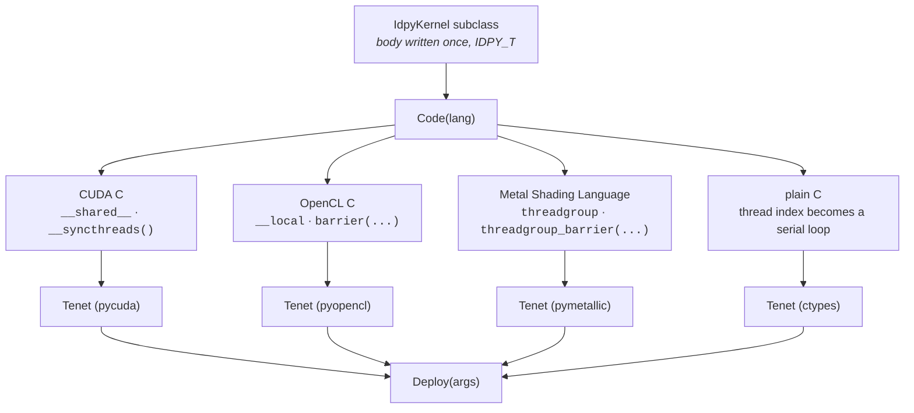
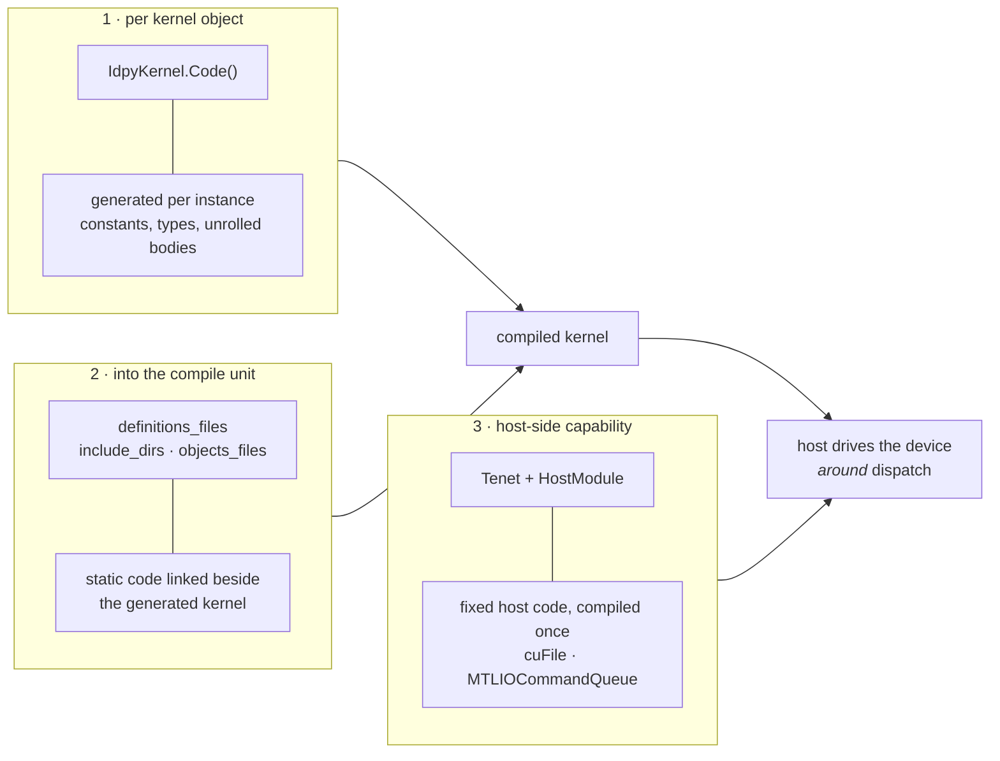
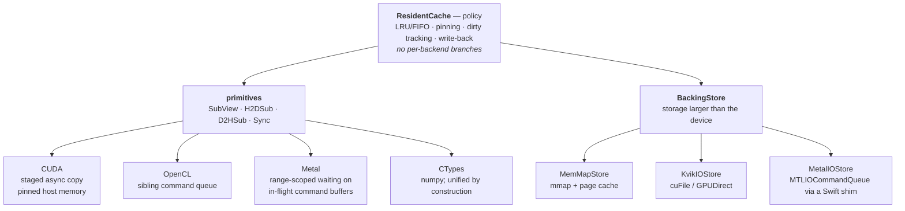

# idpy architecture

Three diagrams, each showing something that is not obvious from the source tree.
Rendered by GitHub directly; no toolchain needed.

---

## 1. One kernel source, four lowerings

A kernel is written once against `IDPY_T`, the metalanguage. `IdpyKernel.Code(lang)`
emits real source for the target, and that source is available for inspection —
there is no hidden compilation step and nothing is rewritten behind your back.

The portable tokens are the point: `idpy_shared`, `idpy_sync`, `idpy_sync_global`
become each backend's native construct at emission. **CTypes is a full peer, not
a fallback** — it has its own `Tenet`, kernel module and array type, and
`Code()` rewrites the SIMT thread index into a loop for it. That the metalanguage
survives the SIMT → non-SIMT transition is why a CPU-only CI job is a meaningful
check on the generator.

---

## 2. Three insertion points, not two

Where code can enter a build. Most frameworks have the first two; the third is
what makes host-side capabilities — storage streaming, residency — expressible
at all.

A kernel body never issues an I/O command — the **host** does, around dispatch.
So storage streaming and residency belong at (3), and channel (2) cannot reach
them. This is also why Swift is a **compiler choice** rather than a language
target: the Metal storage shim is fixed host code built by `HostModule`, so
there is no `SWIFT_T` in `idpy_langs_dict`.

---

## 3. The residency layer: where the backends stop mattering

Holding a working set larger than device memory. The asymmetry is the design's
central claim.

**The policy layer contains no per-language branches at all.** The primitives
beneath it are genuinely different — a staged asynchronous copy on CUDA, a
second queue on OpenCL, waiting against in-flight command buffers on Metal,
plain numpy on CTypes — while the policy expressed on top is one program.

Measured rather than asserted: the same blocked stencil sweep reports **62 hits
and 34 misses on every backend**, matching the closed form `hits = 2(n-1)`,
`misses = n+2` exactly. Identical traffic across four backends is what
demonstrates the policy is backend-independent; identical *output* alone would
not have, since a diverging cache would still return correct numbers by
reloading.

`ReadBlockInto` returns `False` to **decline**, and declining is not an error —
it is how a store says it has no direct path here, after which the cache falls
back without caring why.

---

## Layering

> `idpy` core never imports `idpy` physics.

| layer | packages |
|---|---|
| core | `IdpyCode`, `CUDA`, `OpenCL`, `CTypes`, `Metal`, `Utils` |
| physics | `LBM`, `IdpyStencils`, `SpinNetworks`, `PRNGS` |

Enforced by `scripts/check_layering.py`, which runs as CI's first step — static
analysis over import statements, so it needs no environment and no GPU. Two
violations are grandfathered in a `KNOWN` allowlist; nothing new may be added.
